# Panduan ERD — Mental Health Predict

Panduan menggambar **Entity Relationship Diagram (ERD)** aplikasi prediksi kesehatan
mental dalam **notasi Chen** (gaya "Logical ERD" — sama seperti `exmp_erd.png` di
folder ini). Semua entitas, atribut, tipe, dan relasi diturunkan langsung dari file
migration di `database/migrations/`, jadi sesuai skema database nyata.

> **Notasi Chen (mengikuti contoh `exmp_erd.png`):**
> - **Entity** = **persegi panjang** (mis. `Ware House`, `Row material`).
> - **Atribut** = **oval/elips** yang terhubung garis ke entitynya. **Primary key**
>   ditulis **bergaris bawah** (mis. <u>ID</u>).
> - **Relationship** = **belah ketupat (diamond)** di antara dua entity (mis. `Store`).
> - **Kardinalitas** = label **`1` / `N` / `M`** ditaruh di garis dekat tiap entity.
>
> Tabel framework (`cache`, `jobs`, `password_reset_tokens`, `sessions`) **tidak**
> dimasukkan ke ERD utama karena bukan domain bisnis. Lihat Bagian 6.

---

## 1. Entitas Inti

| Entitas | Tabel | Peran |
|---------|-------|-------|
| **User** | `users` | Pengguna terdaftar. Bisa berperan **admin** (`is_admin = true`) untuk mengelola pengguna & model |
| **Prediction** | `predictions` | Satu hasil prediksi (manual atau batch CSV) milik seorang user |
| **ModelVersion** | `model_versions` | Satu sesi pelatihan model (base atau hasil retrain). Punya status lifecycle + metrik per-algoritma + artifact terisolasi |
| **ModelMetric** | `model_metrics` | Metrik evaluasi model **aktif** (disinkronkan dari `ModelVersion` aktif saat di-approve). Dipakai halaman publik Info Model |

---

## 2. Atribut & Tipe

> Di notasi Chen, **setiap baris tabel di bawah = satu oval atribut**. Kolom PK
> digambar dengan teks **bergaris bawah**.

### User (`users`)
| Kolom | Tipe | Keterangan |
|-------|------|------------|
| `id` (PK) | BIGINT | Primary key, auto-increment |
| `name` | VARCHAR(255) | Nama pengguna |
| `email` | VARCHAR(255) UNIQUE | Email, unik |
| `is_admin` | BOOLEAN, default `false` | Penanda admin. `true` → akses panel `/admin` |
| `email_verified_at` | TIMESTAMP NULL | Waktu verifikasi email |
| `password` | VARCHAR(255) | Hash password |
| `remember_token` | VARCHAR(100) NULL | Token "remember me" |
| `created_at` / `updated_at` | TIMESTAMP | Timestamps Laravel |

### Prediction (`predictions`)
| Kolom | Tipe | Keterangan |
|-------|------|------------|
| `id` (PK) | BIGINT | Primary key |
| `user_id` (FK) | BIGINT NULL | → `users.id`, `nullOnDelete` |
| `selected_model` | VARCHAR(20) NULL | Model dipilih (`knn`, `svm`, `dt`, + varian `_hpo`) |
| `input_features` | JSON | 24 fitur input dari form |
| `knn_prediction` | TINYINT NULL | Kelas 0/1/2 (legacy multi-model) |
| `svm_prediction` | TINYINT NULL | Kelas 0/1/2 (legacy) |
| `dt_prediction` | TINYINT NULL | Kelas 0/1/2 (legacy) |
| `knn_confidence` | FLOAT(8,4) NULL | 0.0000–1.0000 (legacy) |
| `svm_confidence` | FLOAT(8,4) NULL | (legacy) |
| `dt_confidence` | FLOAT(8,4) NULL | (legacy) |
| `final_prediction` | TINYINT | Hasil prediksi akhir (kelas risiko 0/1/2) |
| `confidence` | FLOAT(8,4) NULL | Confidence model terpilih |
| `created_at` / `updated_at` | TIMESTAMP | Timestamps |

> Kolom `*_prediction` & `*_confidence` per-algoritma adalah **sisa skema lama**
> (majority voting 3 model). Skema sekarang pakai `selected_model` + `final_prediction`
> + `confidence`. Di ERD boleh dikelompokkan sebagai oval blok "legacy".

### ModelVersion (`model_versions`)
| Kolom | Tipe | Keterangan |
|-------|------|------------|
| `id` (PK) | BIGINT | Primary key |
| `status` | VARCHAR, index | Lifecycle: `pending` → `active` / `archived` / `rejected` |
| `label` | VARCHAR NULL | Nama versi, mis. `Base`, `Retrain #3` |
| `metrics` | JSON NULL | Metrik per-algoritma (KNN, KNN+HPO, SVM, SVM+HPO, DT, DT+HPO) |
| `dataset_size` | INT UNSIGNED, default 0 | Total baris data saat training (dataset awal + kontribusi user) |
| `user_rows_used` | INT UNSIGNED, default 0 | Jumlah baris kontribusi user yang dipakai |
| `artifact_path` | VARCHAR NULL | Lokasi relatif artifact `.pkl`, mis. `versions/3`. Di-null-kan saat `rejected` |
| `approved_at` | TIMESTAMP NULL | Waktu admin menyetujui versi jadi aktif |
| `approved_by` (FK) | BIGINT NULL | → `users.id`, `nullOnDelete`. Admin yang meng-approve |
| `created_at` / `updated_at` | TIMESTAMP | Timestamps |

> **Lifecycle status:** retrain/bootstrap membuat versi `pending`. Admin **approve**
> → versi jadi `active` (versi aktif lama → `archived`) dan pointer
> `storage/models/active_version.json` diarahkan ke `artifact_path`-nya. Admin
> **reject** → file artifact dihapus, status `rejected`. Inference (`predict.py`)
> **selalu** memuat versi `active` via pointer, sehingga hasil retrain tidak dipakai
> sebelum disetujui.

### ModelMetric (`model_metrics`)
| Kolom | Tipe | Keterangan |
|-------|------|------------|
| `id` (PK) | BIGINT | Primary key |
| `algorithm` | VARCHAR(255) | `'KNN'`, `'KNN+HPO'`, `'SVM'`, `'SVM+HPO'`, `'DT'`, `'DT+HPO'` |
| `accuracy` | FLOAT(8,4) | 0.0000–1.0000 |
| `precision` | FLOAT(8,4) | |
| `recall` | FLOAT(8,4) | |
| `f1_score` | FLOAT(8,4) | |
| `created_at` / `updated_at` | TIMESTAMP | Timestamps |

> `model_metrics` = cache metrik model **aktif**, di-sync dari `ModelVersion` saat
> approve. Entitas **standalone** (tanpa relationship/diamond).

---

## 3. Relasi (Relationship-set Chen)

| Relationship (diamond) | Entity terkait | Kardinalitas | Penjelasan |
|------------------------|----------------|--------------|------------|
| **Membuat** | User — Prediction | `1` : `N` | Satu user membuat banyak prediksi. FK `predictions.user_id` (`SET NULL`). |
| **Menyetujui** | User (admin) — ModelVersion | `1` : `N` | Satu admin meng-approve banyak versi model. FK `model_versions.approved_by` (`SET NULL`, nullable). |
| *(tanpa relationship)* | ModelMetric | — | Standalone, cache metrik model aktif (tak ada diamond). |

Detail FK:
- `predictions.user_id` → `users.id`, `ON DELETE SET NULL`.
- `model_versions.approved_by` → `users.id`, `ON DELETE SET NULL` (versi `pending`/`Base` bisa belum punya approver → NULL).

---

## 4. Kode Mermaid — gaya Chen (render di GitHub / VS Code)

Mermaid `erDiagram` hanya mendukung crow's-foot, **bukan** Chen. Untuk meniru gaya
contoh (`exmp_erd.png`) dipakai `flowchart`: **persegi** = entity, **oval/stadium
`([...])`** = atribut, **diamond `{...}`** = relationship, label `1/N/M` di garis.
PK ditandai `(PK)` (Mermaid tak bisa garis bawah; saat menggambar manual, garis-bawahi).

```mermaid
flowchart TB
    %% ===== ENTITIES (persegi) =====
    USERS[USERS]
    PRED[PREDICTIONS]
    MV[MODEL_VERSIONS]
    MM[MODEL_METRICS]

    %% ===== RELATIONSHIPS (diamond) =====
    R1{Membuat}
    R2{Menyetujui}

    USERS ---|1| R1
    R1 ---|N| PRED
    USERS ---|1| R2
    R2 ---|N| MV

    %% ===== ATTRIBUTES USERS (oval) =====
    U_id([id PK]) --- USERS
    U_name([name]) --- USERS
    U_email([email UK]) --- USERS
    U_admin([is_admin]) --- USERS
    U_ev([email_verified_at]) --- USERS
    U_pwd([password]) --- USERS
    U_rt([remember_token]) --- USERS
    U_ts([created_at / updated_at]) --- USERS

    %% ===== ATTRIBUTES PREDICTIONS (oval) =====
    P_id([id PK]) --- PRED
    P_uid([user_id FK]) --- PRED
    P_sel([selected_model]) --- PRED
    P_feat([input_features]) --- PRED
    P_final([final_prediction]) --- PRED
    P_conf([confidence]) --- PRED
    P_legacy(["*_prediction / *_confidence (legacy)"]) --- PRED
    P_ts([created_at / updated_at]) --- PRED

    %% ===== ATTRIBUTES MODEL_VERSIONS (oval) =====
    V_id([id PK]) --- MV
    V_status([status]) --- MV
    V_label([label]) --- MV
    V_metrics([metrics]) --- MV
    V_dsize([dataset_size]) --- MV
    V_urows([user_rows_used]) --- MV
    V_path([artifact_path]) --- MV
    V_appat([approved_at]) --- MV
    V_appby([approved_by FK]) --- MV
    V_ts([created_at / updated_at]) --- MV

    %% ===== ATTRIBUTES MODEL_METRICS (oval) =====
    M_id([id PK]) --- MM
    M_algo([algorithm]) --- MM
    M_acc([accuracy]) --- MM
    M_prec([precision]) --- MM
    M_rec([recall]) --- MM
    M_f1([f1_score]) --- MM
    M_ts([created_at / updated_at]) --- MM
```



> `MODEL_METRICS` sengaja tanpa diamond — entitas standalone.

---

## 5. Cara Menggambar Manual (draw.io / Lucidchart) — sesuai `exmp_erd.png`

Ikuti notasi Chen seperti contoh:

1. **Entity = persegi panjang.** Buat 4 kotak: `USERS`, `PREDICTIONS`,
   `MODEL_VERSIONS`, `MODEL_METRICS`.
2. **Atribut = oval/elips** yang ditarik garis ke entitynya. Salin setiap kolom di
   Bagian 2 jadi satu oval. **PK digaris-bawahi** (mis. <u>id</u>). Tandai FK dengan
   teks `(FK)`, UNIQUE dengan `(UK)`.
3. **Relationship = belah ketupat (diamond)** di antara dua entity:
   - `Membuat` di antara `USERS` dan `PREDICTIONS`.
   - `Menyetujui` di antara `USERS` dan `MODEL_VERSIONS`.
4. **Kardinalitas = label `1` / `N` / `M`** di garis dekat tiap entity:
   - `USERS —1— (Membuat) —N— PREDICTIONS`.
   - `USERS —1— (Menyetujui) —N— MODEL_VERSIONS`.
5. **`MODEL_METRICS` berdiri sendiri** — tanpa diamond/garis ke entity lain.
6. Kelompokkan oval `*_prediction` / `*_confidence` sebagai blok **legacy** agar
   pembaca paham itu peninggalan skema lama.
7. Tata letak meniru contoh: entity di tengah, oval atribut mengelilinginya, diamond
   relationship menghubungkan antar-entity dengan label kardinalitas.

> **Catatan gaya:** contoh `exmp_erd.png` memakai warna (entity biru, atribut merah,
> relationship ungu). Warna opsional — yang wajib adalah **bentuk** (persegi/oval/
> diamond), **garis bawah PK**, dan **label kardinalitas 1/N/M**.

---

## 6. (Opsional) Tabel Sistem Laravel

Kalau dosen/penguji minta ERD lengkap termasuk tabel bawaan, tambahkan sebagai
entity (persegi) tambahan:

| Tabel | Kolom kunci | Catatan |
|-------|-------------|---------|
| `password_reset_tokens` | `email` (PK), `token`, `created_at` | Reset password |
| `sessions` | `id` (PK), `user_id` (index, bukan FK), `payload`, `last_activity` | Session driver DB |
| `cache` / `cache_locks` | `key` (PK) | Cache driver DB |
| `jobs` / `job_batches` / `failed_jobs` | `id` (PK) | Queue driver DB (dipakai `RetrainModelsJob`) |

Catatan: `sessions.user_id` hanya **index**, bukan foreign key formal — gambar
sebagai relasi lemah atau abaikan untuk ERD domain bisnis.

---

## 7. (Opsional) Alternatif relasional cepat — dbdiagram.io (DBML)

DBML menghasilkan diagram **relasional (crow's-foot)**, bukan Chen — pakai hanya
kalau butuh draf cepat, bukan untuk menyamai `exmp_erd.png`.

```dbml
Table users {
  id bigint [pk]
  name varchar
  email varchar [unique]
  is_admin boolean [default: false]
  email_verified_at timestamp
  password varchar
  remember_token varchar
  created_at timestamp
  updated_at timestamp
}

Table predictions {
  id bigint [pk]
  user_id bigint [ref: > users.id, null]
  selected_model varchar(20)
  input_features json
  knn_prediction tinyint
  svm_prediction tinyint
  dt_prediction tinyint
  knn_confidence float
  svm_confidence float
  dt_confidence float
  final_prediction tinyint
  confidence float
  created_at timestamp
  updated_at timestamp
}

Table model_versions {
  id bigint [pk]
  status varchar [note: 'pending/active/archived/rejected']
  label varchar [null]
  metrics json [null]
  dataset_size int [default: 0]
  user_rows_used int [default: 0]
  artifact_path varchar [null]
  approved_at timestamp [null]
  approved_by bigint [ref: > users.id, null]
  created_at timestamp
  updated_at timestamp
}

Table model_metrics {
  id bigint [pk]
  algorithm varchar
  accuracy float
  precision float
  recall float
  f1_score float
  created_at timestamp
  updated_at timestamp
}
```
