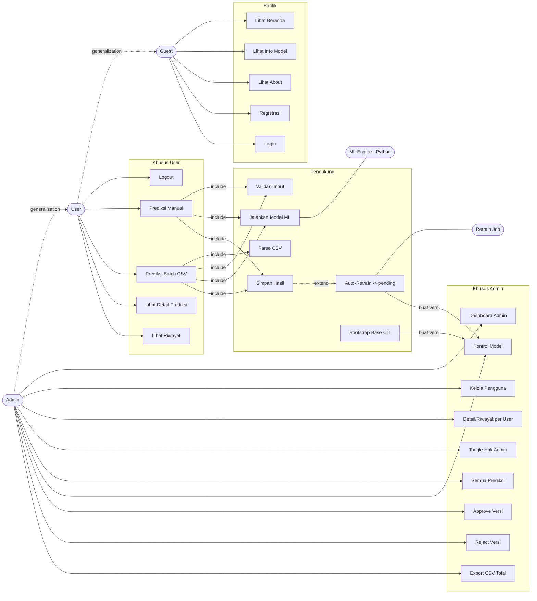
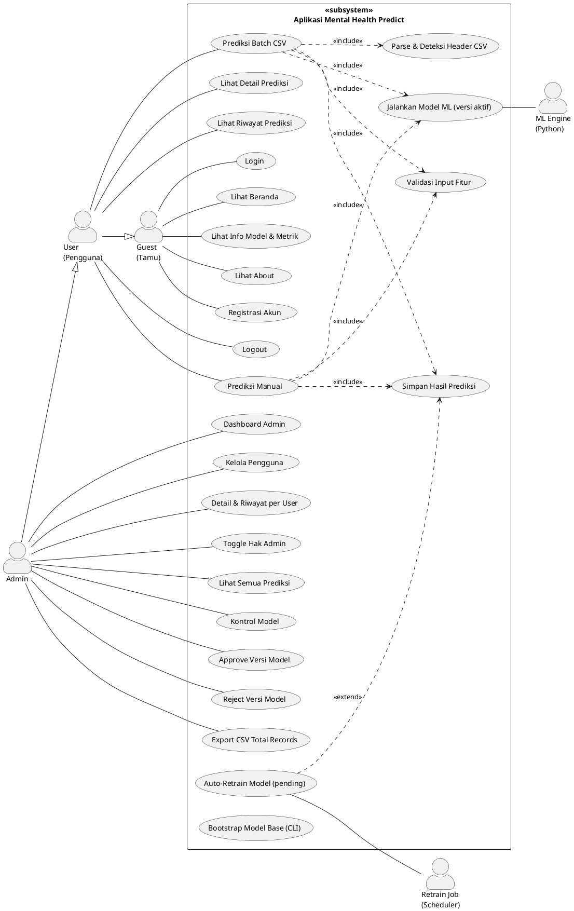

# Panduan Use Case Diagram — Mental Health Predict

Panduan ini menjabarkan **aktor**, **use case**, dan **relasi** aplikasi prediksi
kesehatan mental, lengkap dengan kode siap-render (Mermaid + PlantUML) untuk
menggambar diagramnya. Semua use case di bawah diturunkan langsung dari
`routes/web.php` dan controller terkait, jadi cocok dengan perilaku aplikasi nyata.

> **Notasi UML klasik (mengikuti contoh `exmp_ucdiagram.png` di folder ini):**
> - **Aktor** = **stick figure (orang lidi)**, ditaruh di **tepi** — aktor utama di
>   **kiri**, aktor pendukung/eksternal di **kanan** (mirip `Bank` di contoh).
> - **Use case** = **oval/elips**, diletakkan **di dalam kotak batas sistem**
>   (system boundary) yang diberi label stereotype **`«subsystem»`** + nama sistem.
> - **Asosiasi** aktor↔use case = **garis lurus polos** (tanpa panah).
> - Relasi `«include»`, `«extend»`, dan generalization (segitiga) adalah penyempurnaan
>   opsional — tidak tampil di contoh sederhana, tapi disertakan di Bagian 5 untuk
>   versi detail.

---

## 1. Aktor

| Aktor | Tipe | Deskripsi |
|-------|------|-----------|
| **Guest (Tamu)** | Primary | Pengunjung belum login. Hanya akses halaman publik + auth. |
| **User (Pengguna)** | Primary | Sudah login. Bisa melakukan prediksi dan lihat riwayat. Mewarisi semua akses Guest. |
| **Admin** | Primary | User dengan `is_admin = true`. Mewarisi semua akses User + mengelola pengguna, data, dan lifecycle model lewat panel `/admin`. |
| **ML Engine (Python)** | Secondary / Supporting | Proses Python (`predict.py`) yang menjalankan model **versi aktif** & mengembalikan hasil prediksi. |
| **Retrain Job** | Secondary / Supporting | `RetrainModelsJob` yang melatih ulang model otomatis (serial, anti-overlap) saat ambang prediksi tercapai, menghasilkan **versi pending**. |

> Catatan generalization: **User** mewarisi semua use case **Guest**; **Admin**
> mewarisi semua use case **User**. Jadi rantainya `Admin ⟶ User ⟶ Guest`.

---

## 2. Daftar Use Case

### Akses publik (Guest, User, Admin)
| ID | Use Case | Sumber |
|----|----------|--------|
| UC-01 | Lihat Beranda (statistik dinamis) | `GET /` → `HomeController@index` |
| UC-02 | Lihat Info Model & Metrik (model aktif) | `GET /models` → `ModelController@index` |
| UC-03 | Lihat Halaman About | `GET /about` |
| UC-04 | Registrasi Akun | `GET/POST /register` → `AuthController@register` |
| UC-05 | Login | `GET/POST /login` → `AuthController@login` |

### Khusus User login (& Admin)
| ID | Use Case | Sumber |
|----|----------|--------|
| UC-06 | Logout | `POST /logout` → `AuthController@logout` |
| UC-07 | Prediksi Manual (1 data) | `POST /predict` → `PredictionController@predict` |
| UC-08 | Prediksi Batch via CSV | `POST /predict/csv` → `PredictionController@predictCsv` |
| UC-09 | Lihat Detail Prediksi | `GET /predict/{id}` → `PredictionController@show` |
| UC-10 | Lihat Riwayat Prediksi | `GET /history` → `HistoryController@index` |

### Khusus Admin (panel `/admin`, middleware `auth` + `admin`)
| ID | Use Case | Sumber |
|----|----------|--------|
| UC-16 | Lihat Dashboard Admin | `GET /admin` → `Admin\DashboardController@index` |
| UC-17 | Kelola Pengguna (daftar) | `GET /admin/users` → `Admin\UserController@index` |
| UC-18 | Lihat Detail & Riwayat Prediksi per User | `GET /admin/users/{user}` → `Admin\UserController@show` |
| UC-19 | Toggle Hak Admin Pengguna | `POST /admin/users/{user}/toggle-admin` → `Admin\UserController@toggleAdmin` |
| UC-20 | Lihat Semua Prediksi (filter per user) | `GET /admin/predictions` → `Admin\PredictionController@index` |
| UC-21 | Kontrol Model (lihat aktif + pending) | `GET /admin/models` → `Admin\ModelVersionController@index` |
| UC-22 | Approve Versi Model (jadikan aktif) | `POST /admin/models/{v}/approve` → `Admin\ModelVersionController@approve` |
| UC-23 | Reject Versi Model (hapus artifact) | `POST /admin/models/{v}/reject` → `Admin\ModelVersionController@reject` |
| UC-24 | Export CSV Total Records | `GET /admin/data/export` → `Admin\DataExportController@export` |

### Use case sistem / CLI
| ID | Use Case | Sumber |
|----|----------|--------|
| UC-25 | Bootstrap Model Base (versi #1 aktif) | CLI `php artisan models:seed-base` → `SeedBaseModel` |

### Use case pendukung (include/extend)
| ID | Use Case | Relasi |
|----|----------|--------|
| UC-11 | Validasi Input Fitur (24 fitur) | `<<include>>` dari UC-07, UC-08 |
| UC-12 | Jalankan Model ML (versi aktif) | `<<include>>` dari UC-07, UC-08 (dilayani ML Engine) |
| UC-13 | Parse & Deteksi Header CSV | `<<include>>` dari UC-08 |
| UC-14 | Simpan Hasil Prediksi | `<<include>>` dari UC-07, UC-08 |
| UC-15 | Auto-Retrain Model (→ versi pending) | `<<extend>>` UC-14 (saat kelipatan ambang tercapai) |

---

## 3. Relasi Penting

- **Generalization:** `Admin` ⟶ `User` ⟶ `Guest` (admin adalah user, user adalah guest yang login).
- **Include (wajib):**
  - UC-07 Prediksi Manual **include** UC-11 Validasi, UC-12 Jalankan Model, UC-14 Simpan.
  - UC-08 Prediksi CSV **include** UC-13 Parse CSV, UC-11 Validasi, UC-12 Jalankan Model, UC-14 Simpan.
- **Extend (opsional/bersyarat):**
  - UC-15 Auto-Retrain **extend** UC-14 — terpicu hanya saat
    `total prediksi % services.retrain.every == 0` (default tiap 50 prediksi).
    Hasilnya **versi `pending`**, bukan langsung dipakai.
- **Governance model (Admin):**
  - UC-15 (Retrain Job) & UC-25 (CLI bootstrap) **menghasilkan** `ModelVersion`.
  - UC-22 Approve mengubah versi `pending` → `active` (versi aktif lama → `archived`),
    memindahkan pointer `active_version.json`, dan sinkron `model_metrics`.
  - UC-23 Reject menghapus artifact versi & set status `rejected`.
  - UC-12 selalu memuat **versi aktif** — jadi hasil retrain tak dipakai sebelum di-approve.
- **Secondary actor:**
  - UC-12 dijalankan oleh **ML Engine (Python)**.
  - UC-15 dieksekusi oleh **Retrain Job**.

---

## 4. Kode Mermaid (render langsung di GitHub / VS Code)

Mermaid tidak punya notasi use-case resmi; di bawah pakai pendekatan graph yang
mendekati. Untuk diagram UML formal, pakai PlantUML di Bagian 5.

---

## 5. Kode PlantUML (UML use case formal — disarankan)

Render via plugin PlantUML (VS Code) atau https://www.plantuml.com/plantuml.

---

## 6. Cara Menggambar Manual (draw.io / Lucidchart) — sesuai `exmp_ucdiagram.png`

Wajib (sama seperti contoh):
1. **Kotak batas sistem** (system boundary) di tengah, beri label stereotype
   **`«subsystem»`** + nama sistem ("Aplikasi Mental Health Predict"). Semua use case
   ada **di dalam** kotak ini.
2. **Use case = oval/elips** di dalam boundary (UC-01 … UC-25), susun vertikal.
3. **Aktor = stick figure (orang lidi)** di tepi:
   - **Kiri**: aktor utama `Guest`, `User`, `Admin`.
   - **Kanan**: aktor pendukung/eksternal `ML Engine (Python)`, `Retrain Job`
     (mirip posisi `Bank` di contoh).
4. **Asosiasi = garis lurus polos** (tanpa panah) dari aktor ke tiap use case yang
   diaksesnya.

Penyempurnaan opsional (TIDAK ada di contoh sederhana — pakai bila perlu versi detail):
5. **Panah putus-putus `«include»`** dari use case utama ke use case wajib
   (UC-07/08 → UC-11/12/14).
6. **Panah putus-putus `«extend»`** dari use case opsional ke yang diperluas
   (UC-15 → UC-14).
7. **Segitiga kosong (generalization)** dari `Admin → User → Guest`.
8. Kelompokkan use case Admin (UC-16..UC-24) dalam blok terpisah agar batas peran jelas.

---

## 7. Ringkasan Alur Inti (untuk narasi laporan)

> Pengguna mendaftar/login, mengisi form 24 fitur kesehatan mental dan memilih
> model (KNN, SVM, atau Decision Tree — versi base maupun HPO). Sistem memvalidasi
> input, memanggil **ML Engine (Python)** yang memuat **model versi aktif** untuk
> menjalankan prediksi, menyimpan hasil beserta confidence, lalu menampilkannya di
> riwayat. Pengguna juga bisa mengunggah CSV untuk prediksi massal.
>
> Setiap kelipatan ambang tertentu (default 50 prediksi), **Retrain Job** otomatis
> melatih ulang model di latar belakang secara **serial (anti-overlap)** dan
> menghasilkan **versi model `pending`** — bukan langsung dipakai. **Admin** membuka
> panel Kontrol Model untuk membandingkan akurasi tiap versi pending terhadap model
> aktif (indikator naik/turun per algoritma), lalu **approve** versi yang lebih baik
> (menjadikannya aktif + sinkron metrik publik) atau **reject** (hapus artifact).
> Dengan begitu akurasi model yang dipakai selalu terkontrol. Admin juga mengelola
> pengguna (termasuk memberi/cabut hak admin), meninjau riwayat prediksi per
> pengguna, dan mengekspor CSV total records (dataset awal + kontribusi user terlatih).
> Saat pertama kali deploy, model base diinisialisasi via CLI `php artisan models:seed-base`.
